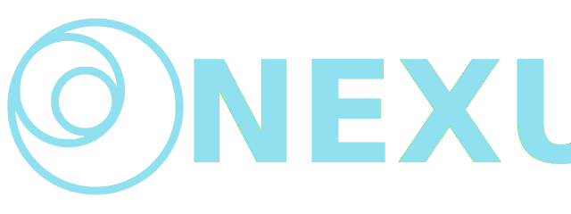

<p align="center" style="text-align: center">
  </a>
</p>

# User service
 The user service handles all the logic regarding the the users. The features are:

- [x] create user
- [x] update user
- [x] delete user
- [x] searching users
- [x] uploading avatar
- [x] updating avatar

## Tech Stack
<a href="http://nestjs.com/" target="blank"></a>

<a href="https://www.mongodb.com/" target="blank"></a>

<a href="https://www.rabbitmq.com/" target="blank"></a>

<a href="https://pnpm.io/" target="blank"></a>


## Architecture
This services is built with the Hexagonal pattern with CQRS.


## Installation
```bash
$ pnpm install
```

## Running the app
```bash
# development
$ pnpm run start

# watch mode
$ pnpm run start:dev

# production mode
$ pnpm run start:prod
```

## Test
```bash
# unit tests
$ pnpm run test

# e2e tests
$ pnpm run test:e2e

# test coverage
$ pnpm run test:cov
```

## Playground
Access the GraphQL playground through `localhost:2000/graphql`

## Docker
```bash
# run MongoDB and RabbitMQ
$ docker-compose up
``` 